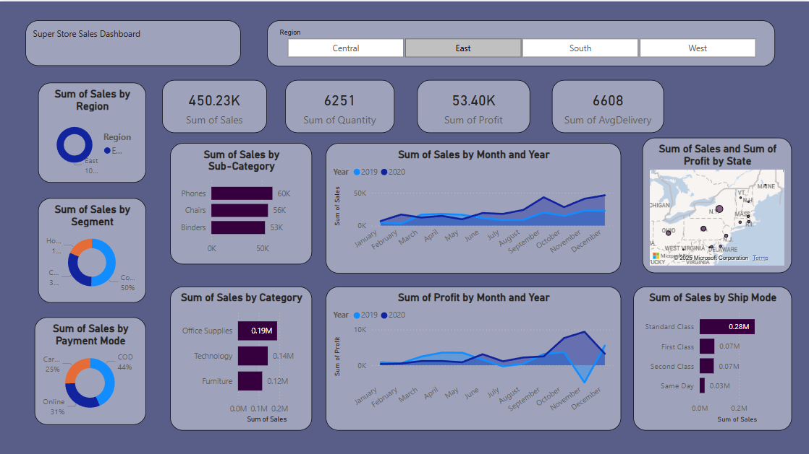

# 🧾 Superstore Sales Dashboard - Power BI Project

## 📊 Overview
This Power BI dashboard analyzes the sales performance of a Superstore across various regions, categories, and time periods. It helps identify sales trends, profit margins, and delivery efficiency.

## 🚀 Features
- KPIs: Total Sales, Profit, Quantity, Avg. Delivery Time
- Filters: Region Selector
- Visuals:
  - Sales by Segment, Category, Sub-category
  - Profit and Sales Trends (monthly)
  - Ship Mode Analysis
  - Geo Map of Sales by State
  - Payment Method Distribution

## 📁 Files
- `dashboard.pbix` - Main Power BI file
- `screenshot.png` - Preview of the dashboard
- `data/Superstore.csv` - Sample dataset (if shareable)
- `insights.md` - Key observations from the analysis

## 🛠️ Tools Used
- Microsoft Power BI
- DAX (for calculated measures)
- Power Query

## 📸 Preview

## 📈 Key Insights
- The East region had the highest sales.
- Technology category gave the highest profit.
- First-class shipping shows the highest sales volume.

---

Feel free to explore and suggest improvements!

